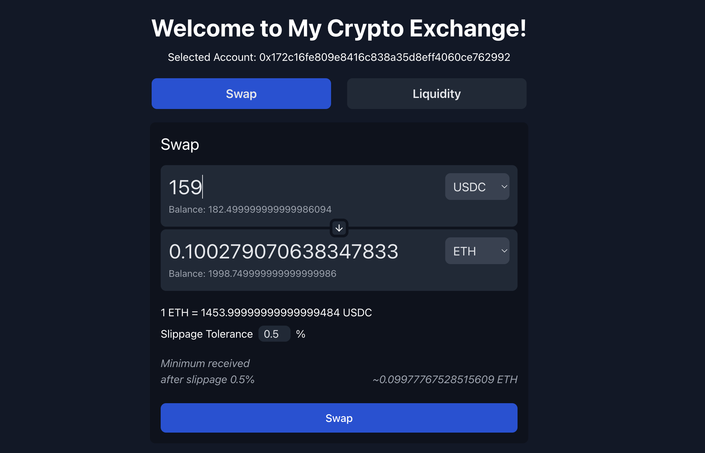

# My Crypto Exchange

A web application based on **Uniswap V2** that enables users to:
- exchange an ERC20 token for another, 
- add a pair of tokens to a liquidity pool,
- remove a percentage of deposited tokens from a pool to collect fees.

#### Screenshots


_Send an exact amount of a token to receive the equivalent amount of another token._


_Send the equivalent amount of a token to receive an exact amount of another token._


_Add liquidity to a pool of tokens' pair. Remove a percentage of liquidity from a pool._

#### User flow

1. When the app is loaded, it prompts for users to connect their Metamask wallet.
2. Once an account is connected, the app displays the page for swapping tokens by default. There's a button to switch to the page for adding and removing liquidity.

##### Swap
1. Users can select two tokens from the dropdown menus and enter an exact amount for one of the two tokens. The equivalent amount of the other token is automatically displayed. 
2. Users can see the price of the one token compared to the other and also their balance of each token.
3. Users can configure the percentage of slippage tolerance for the swap. The min received or max sent amount after slippage is automatically displayed.
4. When users click **Swap**, Metamask popup is opened displaying the total cost and the option to confirm the transaction. 
5. A toast message notifies the user about the success or failure of the transaction.

##### Add liquidity
1. Users can select two tokens from the dropdown menus and enter the exact amounts to add to the pool.
2. Users can see the price of the one token compared to the other and also their balance of each token.
3. Users can configure the percentage of slippage tolerance for the operation.
4. When users click **Add Liquidity**, Metamask popup is opened displaying the total cost and the option to confirm the transaction. 
5. A toast message notifies the user about the success or failure of the transaction.

##### Remove liquidity
1. Users can select two tokens from the dropdown menus.
2. Users can set the percentage of liquidity to remove by dragging a slider. 
3. The amounts of tokens to be retrieved after removing liquidity are displayed.
4. When users click **Remove Liquidity**, Metamask popup is opened displaying the total cost and the option to confirm the transaction. 
5. A toast message notifies the user about the success or failure of the transaction.

#### Tech Stack

- **Solidity** for Smart Contract development.
- **Truffle** and **Ganache** for Ethereum development environment.
- **web3.js** for the web app to interact with the smart contract.
- **Metamask** for in-browser user authentication.
- **React.js** for the web application development.
- **Tailwind css** for styling the web app.
- **Mocha / Chai** for testing the smart contract.

#### Instructions to build and run the app

1. Start an ethereum node (eg using Ganache) on port 9545.

2. Compile the smart contracts to create their artifacts:

```bash
truffle compile
```

3. Generate the Typescript types of the smart contracts for truffle:

```bash
npm run generate-types
```

4. Transpile the Typescript migrations to Javascript:

```bash
npm run transpile-migrations
```

5. Run migrations (might need sudo):

```bash
truffle migrate
```

6. For demo purposes, 4 mock ERC20 tokens are deployed. To use them in the web app: 
 - Copy their addresses found in the deployment logs
 `"Created new instance of token ... at address ..."`.
- Set their addresses in the `src/artifacts/deployed-tokens.json`.

7. The web app also requires the json files of some of the deployed contracts:
 - From `build/contracts`, copy the json files of `ERC20Mock`, `Factory`, `Library` and `Router`.
 - Paste them in `src/artifacts`.

8. Generate the Typescript types of the smart contracts for the web app:

```bash
npm run generate-types-client
```

9. Run the web app:
```bash
npm run start
```

#### Instructions for the first run of the app

The first time the app is run _(or each time the contracts are re-deployed)_, the following actions are necessary:

1. Unhide the `Mint tokens with zero balance` button in `App.tsx` to mint 1000 of each mock token to play around.
2. Add liquidity for each token pair to enable the swapping of tokens of each pair.